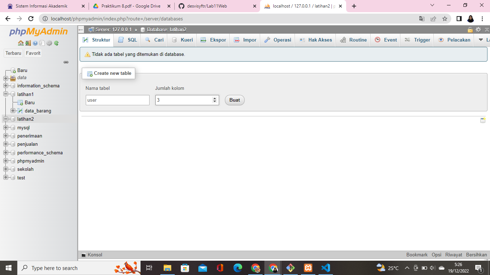
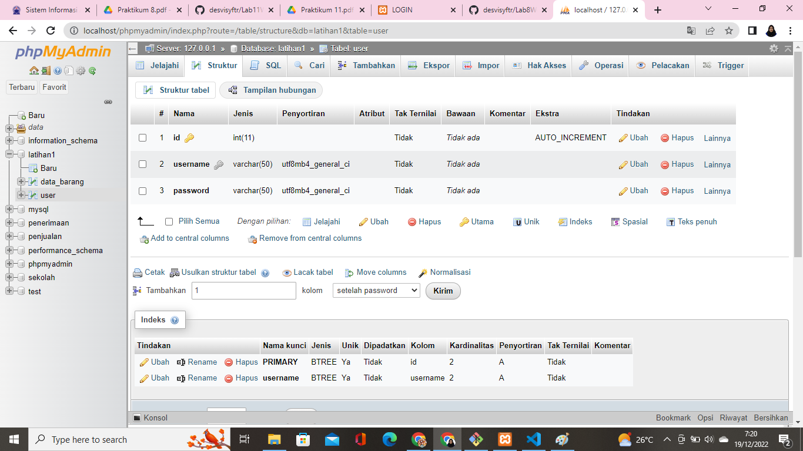
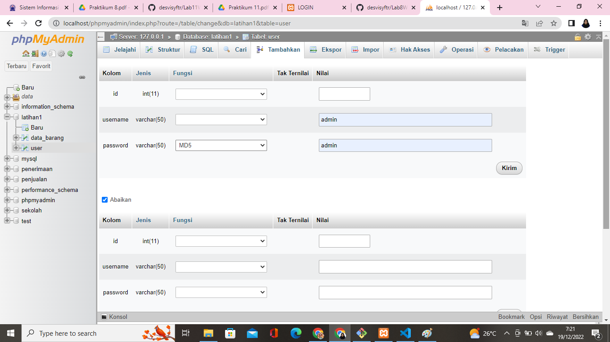
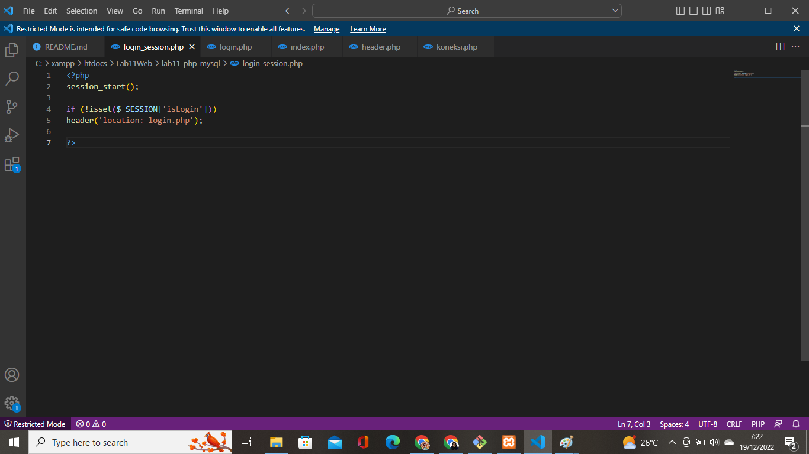
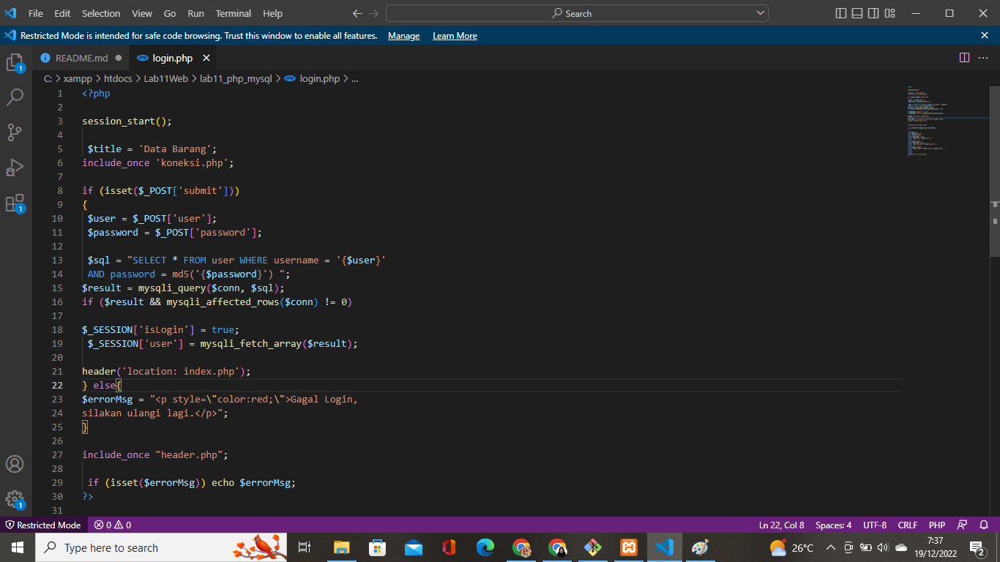
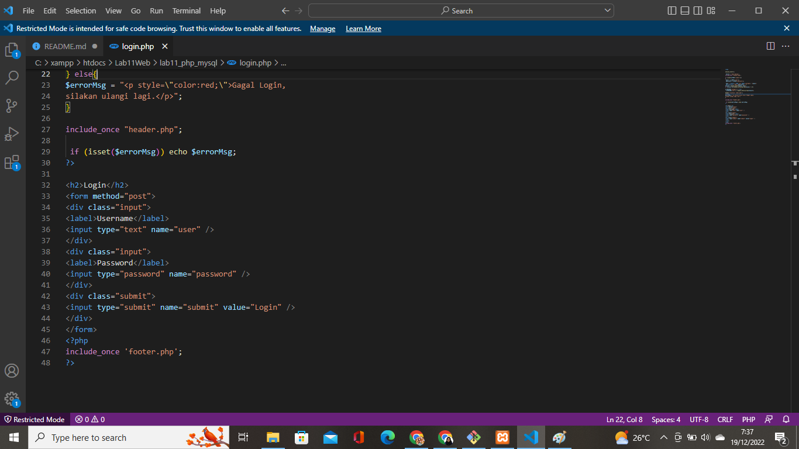
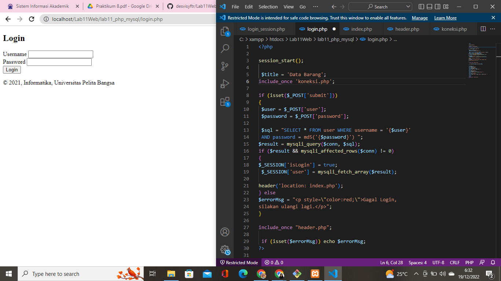
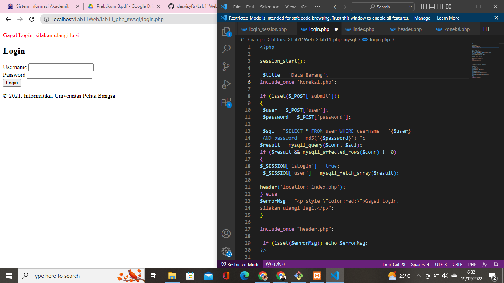
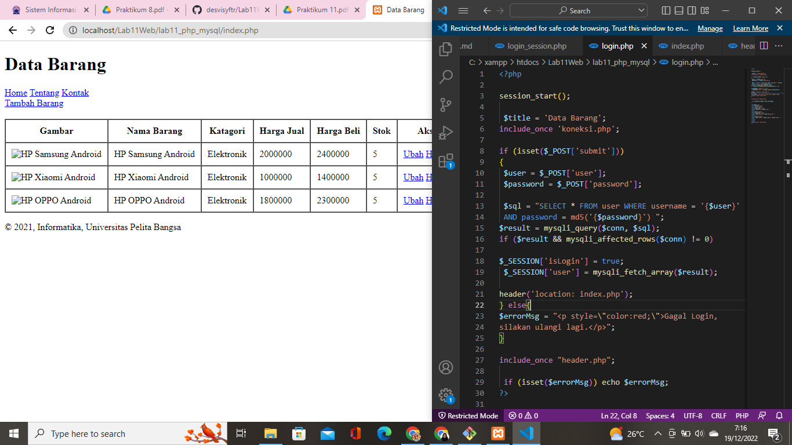

# Lab11Web
## Login Form

### Menjalankan Web server dan Membuat Database
Seperti biasa kita harus menjalankan web server yang ada di XAMPP control apache dan MySQL lalu buka phpadmin melalui http://localhost/phpmyadmin/ dan create new table dengan nama user pada latihan1, begini tampilannya:

setelah database terbuat kita masukkan id(int), username(varchar), dan password(varchar). Begini tampilannya:

lalu, klik insert atau tambahkan dan kita masukkan saja username dan password(dengan menggunakan fungsi MD5) yang kita inginkan. Begini tampilannya:

### Meembuat File Login Session
File ini digunakan untuk pengecekan sesi login, file ini nantinya akan di include di setiap halaman yang membutuhkan login. Begini  tampilannya:

### Membuat File Login
setelah membuat file login session kita membuat file login.php dengan kode berikut, begini tampilannya:

### Hasilnya
begini lah tampilan hasil dari file login.php:

lalu ini adalah hasil jika kita memasukkan username dan password yang salah:

dan inilah hasil jika kita memasukkan username dan paswword yang benar maka akan langsung terbuka file index.php:

